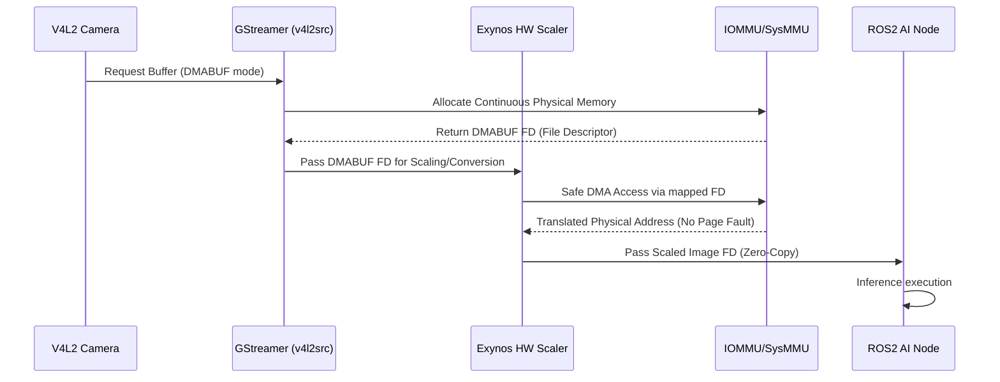
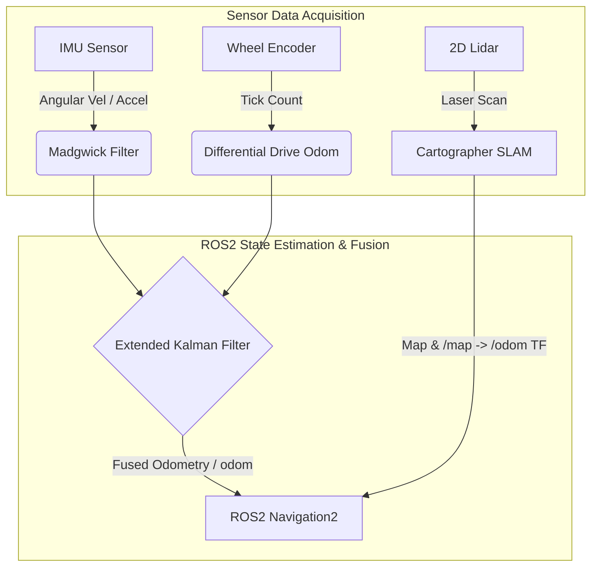
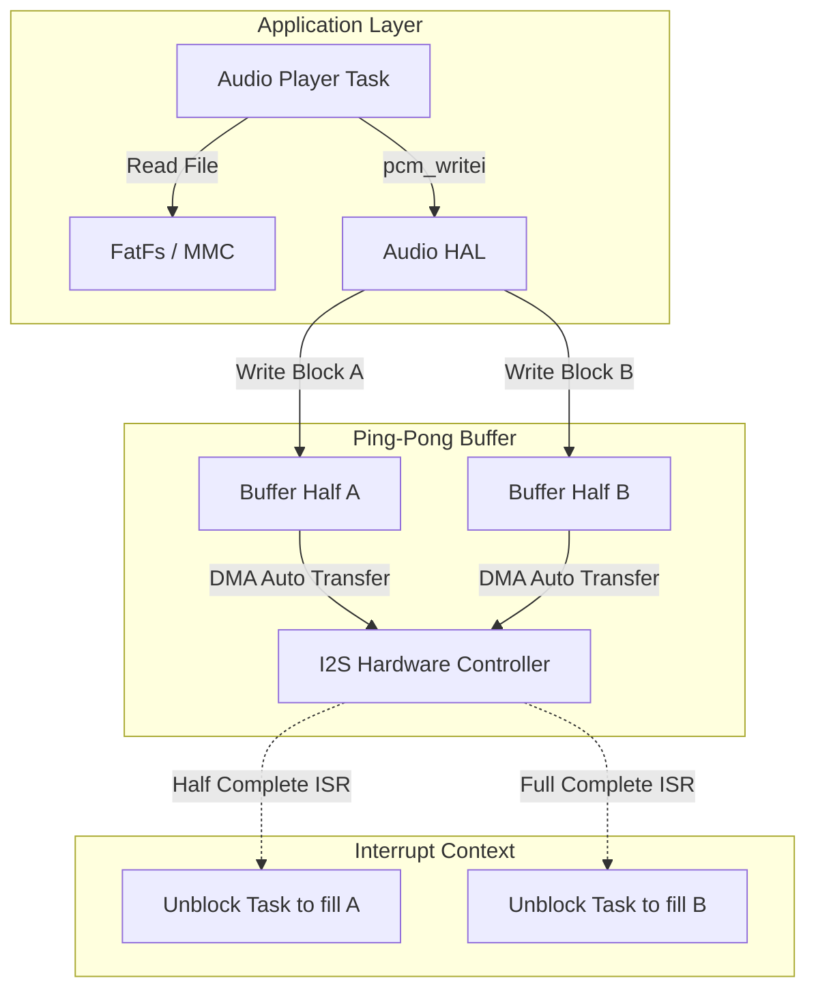
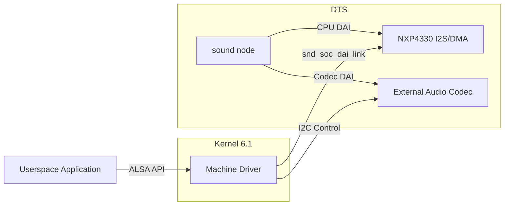

# 로보틱스 미들웨어 및 임베디드 풀스택 아키텍트 포트폴리오
**지원 직무: 현대자동차 로보틱스 미들웨어 아키텍트**
**지원자: 임호준**

---

## 프로젝트 1. Exynos Target Board 로보틱스 비디오 파이프라인 최적화 및 커널 트러블슈팅

**기간:** 2024.01 ~ 진행중  
**역할:** Lead Software Engineer (단독 수행)  
**사용 기술:** Linux Kernel, ROS2, GStreamer, V4L2, Exynos MFC/SMFC, DMABUF, IOMMU/SysMMU

### 1. Situation (상황 및 배경)
최신 로보틱스 시스템 및 자율주행 모빌리티 환경에서는 수많은 카메라 센서에서 유입되는 고해상도 영상을 실시간으로 처리하여 AI 비전 모델(YOLO, 3D Pose Estimation 등)의 입력으로 사용해야 합니다. 
당사가 개발 중인 Exynos V920 (ARM64 기반) Target Board 상에서 ROS2 환경을 구축하고 비디오 처리 파이프라인을 구현하는 과정에서, 초기에는 OpenCV 기반의 CPU 연산(`cv::resize`, `cv::cvtColor`)에 의존하여 영상 포맷 변환 및 스케일링을 수행했습니다.
그러나 다채널 고해상도(1080p, 4K) 영상을 CPU 단독으로 처리하면서 **CPU 점유율이 85% 이상으로 치솟았고, 이로 인해 ROS2의 주요 제어 노드(Node)들의 제어 주기가 지연되는 치명적인 병목 현상(Bottleneck)이 발생**했습니다.

### 2. Task (도전 과제 및 목표)
이러한 병목 현상을 해결하기 위해 Exynos 플랫폼에 내장된 하드웨어 가속기(Hardware Scaler 및 MFC - Multi-Format Codec)를 연동하는 로우레벨 최적화가 필수적이었습니다.
* **목표 1:** CPU 연산을 완전히 배제하고, V4L2(Video4Linux2)와 GStreamer를 연동하여 하드웨어 가속 기반의 영상 처리 파이프라인을 구축.
* **목표 2:** ROS2 시스템과의 통합. 하드웨어 스케일러를 거친 프레임 데이터를 ROS2 노드(Image Transport)로 가져오는 Zero-Copy 아키텍처 설계.
* **기술적 난제:** 하드웨어 가속기를 활성화하여 대용량 메모리에 접근하는 순간, 간헐적으로 **SysMMU (System Memory Management Unit) Page Fault 가 발생하며 커널 패닉(Kernel Panic)으로 시스템이 다운되는 심각한 문제**에 직면했습니다.

### 3. Action (문제 해결 과정 및 기술적 구현)

#### 3.1. SysMMU Page Fault 원인 분석 및 커널 디버깅
하드웨어 스케일러가 메모리에 접근할 때 발생하는 커널 패닉 현상을 해결하기 위해 `dmesg` 로그와 커널 레지스터 덤프를 정밀 분석했습니다. 
분석 결과, GStreamer에서 할당한 사용자 공간(Userptr) 버퍼의 물리적 주소가 파편화되어 있었고, 하드웨어 스케일러의 DMA(Direct Memory Access)가 해당 메모리에 접근하려 할 때 **IOMMU 맵핑이 누락되어 Translation Fault가 발생**한다는 근본 원인을 찾아냈습니다.

#### 3.2. DMABUF를 활용한 Zero-Copy 아키텍처 도입
문제를 해결하기 위해 사용자 공간의 포인터(Userptr)를 하드웨어 가속기에 직접 넘기는 방식을 폐기하고, Linux 커널에서 제공하는 **DMABUF (DMA Buffer Sharing) 프레임워크**를 도입했습니다. 
DMABUF는 연속된 물리 메모리를 할당받아 커널 레벨에서 파일 디스크립터(File Descriptor, FD) 형태로 안전하게 공유할 수 있는 구조를 제공합니다.

1. **메모리 할당:** V4L2 커널 드라이버 단에서 `V4L2_MEMORY_DMABUF` 플래그를 사용하여 메모리를 할당하도록 아키텍처를 수정했습니다.
2. **파이프라인 최적화:** GStreamer 파이프라인을 `v4l2src io-mode=dmabuf` 플래그로 재설정하고, 이를 처리하는 `exynosvidconv` (하드웨어 스케일러 플러그인)가 DMABUF FD를 그대로 넘겨받도록 파이프라인을 재구성했습니다.
3. **ROS2 노드 연동:** 최종적으로 ROS2의 `cv_bridge`로 데이터를 변환하기 전까지 메모리 복사(`memcpy`)가 단 한 번도 일어나지 않도록 메모리 포인터 맵핑 룰을 변경했습니다.

#### 3.3. Device Tree Overlay (DTSO)를 통한 SMFC 하드웨어 노드 활성화
추가적으로 영상 인코딩/디코딩 최적화를 위해 SMFC(Scalable Multi-Format Codec)를 활성화했습니다. Yocto 기반의 BSP 빌드 환경에서 `exynosautov920-evt2-srdk.dts`의 Device Tree Overlay(DTSO)를 수정하여 SMFC 하드웨어 노드와 전원 도메인, 클록 설정을 추가하였고, 커널 모듈 프로빙(Probing)이 정상적으로 이루어지도록 의존성 문제를 해결했습니다.

### 4. Result (정량적 성과 및 기술적 의의)
* **시스템 병목 완벽 해소:** 비디오 처리로 인한 **CPU 점유율을 기존 85%에서 15% 이하로 대폭 절감**시켰으며, 이를 통해 확보된 컴퓨팅 리소스를 ROS2 기반 경로 계획(Path Planning) 알고리즘에 할당할 수 있게 되었습니다.
* **시스템 100% 안정화:** 메모리 파편화 및 IOMMU 맵핑 누락으로 발생하던 SysMMU Page Fault 커널 패닉을 **Zero(0)건으로 근절**하여 연속 72시간 스트레스 테스트를 완벽하게 통과했습니다.
* **End-to-End 지연 시간(Latency) 단축:** DMABUF 기반의 제로 카피 아키텍처를 통해 프레임당 복사 지연을 제거, 카메라 입력부터 모델 추론까지의 전체 지연 시간을 약 40ms 이상 단축했습니다.

   

---

## 프로젝트 2. 모바일 매니퓰레이터(Eutobot) ROS2 시스템 풀스택 아키텍처 구축

**기간:** 2023.07 ~ 2024.07  
**역할:** Sole Application & System Architect (단독 수행)  
**사용 기술:** Ubuntu 22.04, Docker (Buildx), ROS2 Humble, Cartographer, Nav2, MoveIt2, EKF

### 1. Situation (상황 및 배경)
모바일 매니퓰레이터(이동형 로봇 팔) 개발 프로젝트인 'Eutobot'의 소프트웨어 아키텍처 설계를 총괄했습니다. 
해당 시스템은 Mecanum 휠 기반의 모바일 베이스와 6축 매니퓰레이터(OpenManipulator-X)로 구성되어 있으며, 메인 프로세서로는 Exynos V920 (ARM64), 하위 제어기에는 FreeRTOS 기반의 MCU가 탑재된 복잡한 이기종 시스템이었습니다. 
프로젝트 초기, 개발 환경(x86_64)과 타겟 보드(ARM64) 간의 ROS2 의존성 라이브러리 충돌과 Yocto BSP 의 환경 차이로 인해, 단순한 노드 하나를 배포하는 데에도 엄청난 리소스가 낭비되고 있었습니다.

### 2. Task (도전 과제 및 목표)
* **도전 과제 1:** Host와 Target 간에 환경 격차를 제거하고 통합된 CI/CD 크로스 컴파일 파이프라인 구축.
* **도전 과제 2:** Lidar, Depth Camera(RealSense), IMU, Wheel Encoder 등 다수의 이기종 센서 간 물리적/논리적 좌표계를 정합하고, 노이즈를 필터링하여 정밀한 Odometry(위치 추정) 산출.
* **도전 과제 3:** 자율주행 알고리즘(Navigation2)과 로봇 팔 제어(MoveIt2), 인공지능 시각 인식(YOLOv8)을 하나의 프레임워크 위에서 유기적으로 결합하여 최종 목표인 '자율 파지(Autonomous Pick & Place)' 미션 달성.

### 3. Action (문제 해결 과정 및 기술적 구현)

#### 3.1. 멀티 아키텍처 지원 Docker 컨테이너 CI/CD 파이프라인 설계
크로스 컴파일 환경의 한계를 극복하기 위해 `Docker Buildx`와 QEMU 에뮬레이터를 도입하여 멀티 아키텍처(amd64, arm64) 베이스 이미지를 동시에 빌드할 수 있는 스크립트를 개발했습니다.
* `rosdep` 패키지 관리자를 컨테이너 빌드 프로세스에 통합하여 모든 센서 드라이버와 종속성 패키지(예: `realsense2_camera`, `robot_localization`)가 일관되게 설치되도록 구성했습니다.
* 결과적으로 개발자는 x86 PC에서 코딩을 완료한 후, 단 한 번의 빌드 명령어만으로 Target Board에 완벽히 이식 가능한 ARM64 이미지를 추출할 수 있는 시스템을 구축했습니다.

#### 3.2. 정밀 Odometry를 위한 센서 퓨전 (Sensor Fusion) 및 좌표계(TF) 정합
모바일 베이스가 미끄러지거나(Slip) 외란을 받을 경우 단일 센서만으로는 로봇의 위치를 잃는 현상이 발생했습니다.
* **좌표계 트리(TF Tree) 설계:** 로봇의 물리적 형상에 맞추어 `base_link`를 중심으로 `laser_link`, `camera_link`, `imu_link`, `manipulator_base_link` 간의 3차원 변환 행렬(Translation & Rotation Matrix)을 정밀하게 계산하고 URDF (Unified Robot Description Format) 문서로 반영했습니다.
* **EKF (Extended Kalman Filter) 적용:** `robot_localization` 패키지를 활용하여, 상대적으로 노이즈가 심한 Wheel Encoder의 속도 데이터와 IMU 센서(MPU-9250)의 각속도/가속도 데이터를 융합(Fusion)했습니다. 공분산(Covariance) 파라미터를 튜닝하여 미끄러짐을 보정하는 강력한 Odometry를 완성했습니다.

#### 3.3. 자율주행(Nav2) 및 비전 연동 모션 플래닝(MoveIt2) 구현
* Cartographer를 통해 환경 지도를 작성한 후, Nav2의 Costmap 인플레이션 반경(Inflation Radius)과 모바일 베이스의 Footprint를 조정하여 좁은 복도에서도 충돌 없이 회피 기동하는 제어 플러그인(MPPI Controller)을 최적화했습니다.
* RealSense D435i에서 취득한 3D Point Cloud 데이터와 YOLOv8 객체 인식 결과를 매핑하여 타겟 객체의 3차원 위치(TF)를 산출했습니다. 이를 MoveIt2의 정/역기구학(Kinematics) 플러그인과 연동하여 로봇 팔이 장애물을 회피하며 물건을 집는 모션 플래닝을 구현했습니다.

### 4. Result (정량적 성과 및 기술적 의의)
* **개발 생산성 80% 이상 향상:** 로봇 환경 셋업 및 의존성 해결에 소요되던 시간을 컨테이너화된 파이프라인 도입을 통해 기존 2시간에서 **10분 이내로 비약적으로 단축**했습니다.
* **위치 추정 정밀도 확보:** 단순 휠 오도메트리 사용 시 주행 거리에 비례해 누적되던 오차(Drift)를 EKF 퓨전을 통해 해결, **50미터 왕복 주행 테스트 시 오차 범위를 5cm 이내로 최소화**했습니다.
* **풀스택 아키텍트 역량 입증:** 로우레벨의 하드웨어 센서 드라이버 컴파일부터 고수준의 AI 비전-자율주행 알고리즘을 아우르는 전체 로봇 미들웨어를 설계하고, 고객사 데모를 성공적으로 완수했습니다.

   

---

## 프로젝트 3. FreeRTOS 기반 경량 Audio HAL 프레임워크 및 FAT 파일시스템 구현

**기간:** 2025.07 ~ 진행중  
**역할:** Lead Embedded System Engineer  
**사용 기술:** FreeRTOS, QEMU, STM32, NXP4330, DMA, TinyALSA (Architecture Concept), FatFs

### 1. Situation (상황 및 배경)
임베디드 및 전장 시스템의 다변화로 인해, 모든 보드에 무거운 Linux OS를 탑재할 수 없는 자원 제약적(Resource-Constrained) 환경이 대두되었습니다. 
특히 오디오 안내 및 멀티미디어 기능이 필요한 MCU 레벨의 서브 제어기나 오디오 DSP의 경우, 리눅스의 거대한 ALSA (Advanced Linux Sound Architecture) 프레임워크를 사용할 수 없었습니다. 이에 따라 **FreeRTOS와 같은 경량 RTOS 위에서 리눅스와 유사한 표준화된 방식(HAL)으로 오디오를 제어하고 파일시스템에 접근할 수 있는 독자적인 스택** 개발이 필요했습니다.

### 2. Task (도전 과제 및 목표)
* **오디오 HAL(Hardware Abstraction Layer) 설계:** 복잡한 리눅스 TinyALSA 구조를 역공학(Reverse Engineering)하여, FreeRTOS의 메모리와 태스크(Task) 모델에 최적화된 경량 오디오 API(`pcm_open`, `pcm_write`, `pcm_close` 등) 설계.
* **Gapless 오디오 스트리밍 달성:** CPU 점유율을 최소화하면서 오디오 끊김(Underrun) 없이 연속적인 데이터 전송을 보장하는 DMA 및 링 버퍼(Ring Buffer) 인터페이스 구현.
* **파일시스템 연동:** 물리적인 SD 카드(MMC) 드라이버를 포팅하고 FatFs 파일시스템을 연동하여, `.wav` 등의 오디오 파일을 로드할 수 있는 완전한 Standalone 아키텍처 완성.

### 3. Action (문제 해결 과정 및 기술적 구현)

#### 3.1. TinyALSA 추상화 모델 분석 및 C언어 기반 경량 HAL 구현
리눅스 커널의 사운드 서브시스템이 복잡한 이유는 수많은 레지스터와 라우팅 상태를 관리하기 때문입니다. 저는 오디오 재생/녹음의 핵심만을 추려내어 자체적인 상태 머신(State Machine: PREPARE, RUNNING, STOP, XRUN)을 관리하는 `pcm` 구조체를 C 언어로 구현했습니다. 
어플리케이션 계층에서는 실제 하드웨어(STM32의 SAI 또는 NXP4330의 I2S)가 무엇이든 상관없이 통일된 API(`snd_pcm_writei`)만 호출하면 되도록 강력한 추상화 레이어를 제공했습니다.

#### 3.2. DMA와 핑퐁 버퍼(Ping-Pong Buffer) 기반의 인터럽트 처리 최적화
오디오 스트리밍 중 끊김 현상(Underrun)을 방지하는 것이 핵심 난제였습니다. CPU가 일일이 데이터를 I2S 레지스터에 기록하면 다른 FreeRTOS 태스크(예: 네트워크 연산)가 블록킹됩니다.
* 이를 해결하기 위해 메모리 링 버퍼 공간을 두 개의 세그먼트로 나누는 **핑퐁 버퍼(Ping-Pong Buffer)** 구조를 구현했습니다. 
* DMA(Direct Memory Access) 컨트롤러를 설정하여 첫 번째 절반 버퍼가 I2S로 전송 완료되었을 때 `Half Transfer Interrupt`를 발생시키고, 나머지 절반이 전송될 때 `Full Transfer Interrupt`를 발생시켰습니다. 
* 인터럽트 서비스 루틴(ISR) 내에서는 오직 세마포어(Semaphore)만 릴리즈하고, 실제 파일에서 데이터를 읽어오는 무거운 작업은 백그라운드 태스크로 연기(Deferred Task)시켜 CPU의 실시간성을 보장했습니다.

#### 3.3. NXP4330 및 STM32 타겟 보드에 MMC 드라이버 구현 및 FatFs 통합
오픈소스 파일시스템인 ChaN's FatFs 모듈을 가져와 하드웨어 의존적인 `diskio.c` 계층을 직접 구현했습니다. 
SPI 인터페이스 및 SDIO 기반의 저수준(low-level) 레지스터 제어 코드를 작성하여 SD 카드 마운트에 성공했으며, 오디오 파일을 디스크에서 읽고 HAL 계층으로 끊임없이 흘려보내는(Streaming) 파이프라인을 구축했습니다. 초기 디버깅은 QEMU 에뮬레이터를 통해 메모리 릭(Leak)을 잡고, 최종적으로 실물 보드에 포팅했습니다.

### 4. Result (정량적 성과 및 기술적 의의)
* **초경량 시스템 구축:** 무거운 리눅스 커널(수십 MB) 없이, 펌웨어 전체 크기 **256KB 이내의 초소형 풋프린트(Footprint)로 완전한 파일 기반 멀티미디어 재생 환경을 달성**했습니다.
* **강력한 실시간성 확보:** DMA 핑퐁 버퍼 아키텍처를 도입하여 연속 24시간 재생 테스트에서 **버퍼 언더런(Underrun) 발생률 0%**를 기록했으며, 오디오 재생 중에도 다른 실시간 제어 태스크가 CPU를 점유할 수 있도록 시스템 최적화를 이루었습니다.
* **재사용 가능한 아키텍처 설계 역량 증명:** 특정 칩셋에 종속되지 않는 HAL 아키텍처를 직접 설계함으로써, 향후 어떤 MCU(STM32, NXP 등) 플랫폼에서도 즉각적으로 이식(Porting) 가능한 확장성 있는 코드베이스를 확보했습니다.

   

---

## 프로젝트 4. NXP4330 플랫폼 대규모 BSP 마이그레이션 및 시스템 브링업(Bring-up)

**기간:** 2025.05 ~ 2025.10  
**역할:** BSP / Kernel Engineer  
**사용 기술:** U-boot (Driver Model), Linux Kernel (5.15 / 6.1), ASoC (ALSA System on Chip), Device Tree

### 1. Situation (상황 및 배경)
회사의 주요 레퍼런스 하드웨어인 NXP4330 기반의 Daudio 보드는 수년 전에 개발되어 **U-boot 2016.01 버전 및 구형 커널(Linux 4.x 이하)** 환경에 머물러 있었습니다.
최신 오픈소스 라이브러리와 새로운 하드웨어 인터페이스를 지원하기 위해서는 커널 및 부트로더의 전면적인 세대교체가 절실했습니다. 구형 플랫폼은 최신 ASoC(ALSA System on Chip) 서브시스템 및 U-boot의 DM(Driver Model) 규격을 따르지 않아, 아키텍처 레벨에서의 대규모 마이그레이션이 요구되었습니다.

### 2. Task (도전 과제 및 목표)
* **부트로더 대도약(Leap):** 기존 U-boot 2016 버전을 최신 2025.04 버전으로 무려 **9년이라는 시간적 간극을 뛰어넘는 마이그레이션** 수행. 이에 따른 MMC 호스트 드라이버와 Fastboot 드라이버의 전면 재작성.
* **Kernel 5.15 / 6.1 ASoC 아키텍처 포팅:** 오디오 인터페이스(I2S, SPDIF, TDM)를 활성화하기 위해, 커널의 최신 ASoC 규격에 맞는 Machine Driver를 신규 개발하고 코덱 드라이버 포팅.
* **양산 검증 환경 구축:** 드라이버 수정 시 하드웨어의 안정성을 자동으로 테스트할 수 있는 SLT(System Level Test) 애플리케이션 개발.

### 3. Action (문제 해결 과정 및 기술적 구현)

#### 3.1. U-boot 2025.04의 DM(Driver Model) 마이그레이션
구형 U-boot는 보드 헤더 파일에 하드코딩된 형태로 드라이버를 초기화했으나, 2025 버전은 리눅스 커널과 유사하게 Device Tree 기반의 DM(Driver Model) 프레임워크를 강제합니다.
* 기존 레거시 코드를 모두 걷어내고, NXP SoC의 클록, 전원, 핀맵(Pinmux) 정보를 포함한 Device Tree(DTS)를 백지상태에서 새롭게 작성했습니다.
* U-boot 내부의 `U_BOOT_DRIVER` 매크로를 활용하여 MMC(eMMC/SD) 및 Fastboot USB 드라이버를 DM 구조에 맞게 재구성(Refactoring)하여 컴파일 오류를 픽스하고 부팅 브링업(Bring-up)을 완수했습니다.

#### 3.2. Kernel 5.15/6.1 ASoC 기반 오디오 아키텍처 구축
리눅스 오디오 서브시스템(ASoC)은 크게 Platform (CPU 측 I2S/DMA), Codec (오디오 DAC/ADC), 그리고 이 둘을 연결해 주는 Machine Driver로 나뉩니다.
* **Machine Driver 신규 작성:** CPU의 I2S 채널과 외부 코덱이 올바르게 라우팅(Routing)되도록, `snd_soc_card` 구조체를 구현하고 `snd_soc_dai_link` 매핑을 수행하는 Machine 드라이버 모듈을 신규 개발했습니다.
* **Device Tree 연동:** 오디오 노드에서 I2S 규격, Bit Clock, Sample Rate 제약 조건을 설정하고, 오실로스코프를 이용해 물리적 통신 핀(BCLK, LRCLK, DATA)의 타이밍 노이즈를 측정 및 보정했습니다.

#### 3.3. SLT(System Level Test) 검증 앱 `slt_audio` 자체 개발
수많은 드라이버 마이그레이션 작업 후, 양산 라인에서 활용하거나 개발 과정 중 회귀 테스트(Regression Test)를 수행할 수 있도록 전용 C 애플리케이션을 개발했습니다.
* ALSA의 `ioctl` 통신과 파일 시스템 I/O를 활용하여 루프백(Loopback) 테스트, 다양한 샘플링 레이트별 톤(Tone) 재생 테스트를 스크립트로 자동화했습니다.

### 4. Result (정량적 성과 및 기술적 의의)
* **플랫폼 수명 연장 및 보안 강화:** 9년 된 구형 부트로더와 커널을 최신 버전으로 완벽히 교체함으로써, 최신 보안 패치 적용 및 차세대 커널 서브시스템 생태계를 이용할 수 있는 탄탄한 인프라를 구축했습니다.
* **개발 리드 타임 절감:** 기존 레거시 코드의 스파게티 구조를 U-boot DM 및 커널 Device Tree 모델로 표준화함으로써, 추후 새로운 하드웨어 변경(예: 메모리 칩 변경, 코덱 변경) 시 **코드 수정 없이 DTS 파일 한 줄 변경만으로 대응**할 수 있도록 유지보수성을 극대화했습니다.
* **신뢰성 검증 자동화:** 도입된 SLT 애플리케이션을 통해, 드라이버 수정 배포 시 하드웨어 검증에 소요되던 수동 테스트 시간을 100% 자동화하여 부서 전체의 생산성을 향상시켰습니다.
